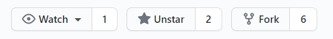
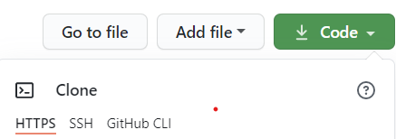
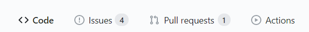

# Getting started

## A guideline of how to start contributing to this repo.

You can contribute by suggesting new topics, look for possible improvements, provide suggestions or by adding resources.

## Code of Conduct:

To know about the code of conduct for this community visit this link: <a href = "https://github.com/DaedalusDreamJournal/datascienceroadmap/blob/master/CODE_OF_CONDUCT.md">Code Of Conduct</a>

## Reason why this repo exist and a guide to get started

Check out [Ken's Jee video on youtube](https://www.youtube.com/watch?v=uXLnbdHMf8w&ab_channel=KenJee) of why he is started **#66daysofdata**

## 1. Familiarize with git

If you are already here you probably know what git is. But, if you do not, watch this [git video tutorial](https://www.youtube.com/watch?v=SWYqp7iY_Tc&ab_channel=TraversyMedia) gear towards beginners.

Also, if you want to find out more please read the [git documentation reference.](https://git-scm.com/docs)

## 2. Fork this repository:

On this github page click on the button "**FORK**" 

## 3. Clone the fork repository to your computer locally:



For example, run the command below on your computer:

```bat
$ git clone https://github.com/<your-github-username>/datascienceroadmap.git
```

Note: Make sure you replace <your-github-username> with your actual username.

## 4. Change directory into the clone directory

For example:

```bat
$ cd datascienceroadmap
```

## 5. Sync your fork

Before you make any changes it is necessary you keep your fork in sync with the **forked master repository** to avoid merge conflicts.

Please, read [How to keep your fork in sync.](https://www.freecodecamp.org/news/how-to-sync-your-fork-with-the-original-git-repository/)

For instance, write the following on your bash/terminal or cmd line:

```bat
$ git remote add upstream https://github.com/DaedalusDreamJournal/datascienceroadmap.git
```

## 6. Make changes

On your local computer with the text editor of your choice open the directory and add the necessary changes. You are going to need to use the git commands:

```bat
$ git add "the-file-your-modifying"
$ git commit -m "please-add-a-message"
```

## 7. Push changes to your local repository

```bat
$ git push origin master
```

At this point it will probably ask you for your git username and password to push the repo.

If you haven't configure your git credentials you can [set it up here.](https://git-scm.com/book/en/v2/Getting-Started-First-Time-Git-Setup)

## 8. Make a pull request

Go to the github page of the fork repository and open a pull request.



<br><br>

## How to synchronize and merge your fork repository

Go to the directory of the fork project and follow these steps:

## 1. Make sure you have the upstream repository

```bat
$ git remote -v
> origin	https://github.com/YOUR_USERNAME/YOUR_FORK.git (fetch)
> origin	https://github.com/YOUR_USERNAME/YOUR_FORK.git (push)
> upstream  https://github.com/ORIGINAL_OWNER/ORIGINAL_REPOSITORY.git (fetch)
> upstream  https://github.com/ORIGINAL_OWNER/ORIGINAL_REPOSITORY.git (push)

```

## 2. Fetch Upstream repository

```bat
$ git fetch upstream
```

The above command will get all the respective commits from the upstream repository.

## 3. Merge Upstream repository

You should be on your local master branch and then finally you can merge and synchronize your fork.

```bat
$ git merge upstream/master
```

For further information you can read [How to sync your github fork.](https://nearsoft.com/blog/how-to-synchronize-your-github-fork/)
